# Semana 03 — Evasión de obstáculos

## Objetivo

Armar una máquina de estados de 2 estados para que el robot avance en linea recta, detecte
con el lidar que está por chocar, gire un ángulo fijo, y siga avanzando —
repitiendo esto para esquivar los obstáculos que se cruce en el camino.

## Teoría: máquina de estados

### ¿Por qué una máquina de estados?

El comportamiento que buscamos (avanzar, y cuando corresponda girar) tiene
dos modos claramente distintos, y en cada momento el robot solo puede estar
haciendo uno de los dos. La tentación, sin pensarlo como una máquina de
estados, es ir agregando variables booleanas sueltas (`girando`, `bloqueado`,
`esquivando`...) y `if`s repartidos por todo el nodo a medida que aparecen
casos nuevos. Eso funciona al principio, pero rápidamente se vuelve difícil
de leer, difícil de debuggear ("¿por qué el robot está haciendo esto
ahora?") y frágil ante casos que no se pensaron de antemano.

Pensar el problema como una máquina de estados obliga a responder dos
preguntas simples y separadas: **¿en qué estado estoy?** y **¿qué hace que
pase de uno a otro?** Toda la complejidad del comportamiento queda ordenada
alrededor de esas dos preguntas, en vez de dispersa en condicionales sueltos.
Esto importa especialmente en robótica porque el programa corre en tiempo
real sobre sensores ruidosos y un entorno que no controlamos del todo — tener
un modelo claro y predecible de "qué hace el robot en cada situación" es lo
que permite razonar sobre el comportamiento y debuggearlo cuando algo no
sale como se esperaba.

### Conceptos

**Estado**: representa la situación actual del sistema. Ejemplos: "Esperando",
"Moviéndose", "Cargando batería". Los estados son excluyentes — el sistema
está en uno solo a la vez.

**Transición**: el cambio de un estado a otro. Ocurre por eventos, sensores,
temporizadores o decisiones lógicas. Es una transición fuerte (discreta): se
está en un estado o en otro, nunca "un poco en cada uno".

En nuestro caso, los estados son `ESTADO_AVANZAR` y `ESTADO_GIRAR`, y las
transiciones son: `hay un obstáculo` y `ya giró lo suficiente`:



### Cómo se traduce esto a código ROS 2

Para que una máquina de estados funcione bien arriba de un robot, conviene
seguir algunas reglas de diseño:

- **El loop principal va adentro de un timer callback**, no de los callbacks
  de los sensores. Si moviéramos el robot directamente desde
  `recibir_scan()` o `recibir_odom()`, la frecuencia de movimiento quedaría
  atada a la frecuencia con la que llega cada sensor (impredecible, y
  distinta para cada uno). Con un timer corremos la máquina de estados a una
  frecuencia fija y conocida (`FRECUENCIA_HZ`), sin importar qué tan seguido
  llegan los sensores.
- **Los callbacks de los sensores solo actualizan variables**, nunca mueven
  el robot ni deciden nada por su cuenta. `recibir_scan()` guarda el último
  [`LaserScan`](https://docs.ros2.org/latest/api/sensor_msgs/msg/LaserScan.html)
  en `self.ultimo_scan`; `recibir_odom()` guarda el yaw actual (a partir de un
  [`nav_msgs/Odometry`](https://docs.ros2.org/latest/api/nav_msgs/msg/Odometry.html))
  en `self.yaw_actual`. Toda la lógica vive en un solo lugar: la máquina de
  estados.
- **Tener una función de transición clara, con estados excluyentes.** La
  transición (decidir si `self.estado` cambia) tiene que estar separada de
  la acción (qué hace el robot en cada estado). Mezclar las dos cosas es lo
  que hace que una máquina de estados sea difícil de leer y de debuggear.
- **Ser verbosos.** Loguear cada transición (`self.get_logger().info(...)`)
  ayuda muchísimo a entender en qué estado está el robot en cada momento,
  sobre todo cuando el comportamiento no es el esperado.
- **Visualizar, no solo loguear.** Un log te dice qué pasó; RViz te deja ver
  *por qué*. La técnica es simple: además de tomar una decisión (como
  `hay_obstaculo()`), republicás la porción de datos que usaste para
  tomarla, como su propio tópico — acá, qué rayos del lidar caen dentro del
  cono de detección. Verlo dibujado en RViz (cuando llegues al workshop de la semana 5) mientras el robot se mueve deja
  confirmar de un vistazo si `angulo_vision_deg` y `distancia_choque_m`
  están calibrados como pensás, en vez de inferirlo indirectamente de que el
  robot gire donde no esperabas. Es la misma idea detrás de `/scan_rojo` en
  semana 04, y conviene tenerla presente como hábito general: cuando algo se
  decide adentro de un nodo y no se ve, es un buen candidato para
  republicarlo, como vamos a ver en la semana 5.

`evasor.py` sigue estas cinco reglas: `recibir_scan()` / `recibir_odom()`
son los callbacks que solo tocan variables, y `maquina_de_estados()` es el
timer callback que corre a `FRECUENCIA_HZ` — primero decide la transición,
después actúa según el estado ya actualizado.

### El paquete ROS 2: `setup.py` y `package.xml`

Además de la máquina de estados, un paquete `ament_python` necesita dos
archivos de configuración para que ROS 2 sepa cómo buildearlo y correrlo:

- **`setup.py`** es el instalador de Python del paquete. La parte que nos
  importa es `entry_points`: ahí se registra qué ejecutables expone el
  paquete y a qué función de qué módulo apuntan. Si un ejecutable no está
  registrado ahí, `ros2 run <paquete> <ejecutable>` no lo va a encontrar,
  aunque el código esté perfecto.
- **`package.xml`** declara, entre otras cosas, las dependencias del
  paquete (`<depend>`) — un `<depend>` por cada paquete de ROS (o librería
  del sistema) que el código importa. [`colcon`](https://colcon.readthedocs.io/)
  y `rosdep` usan esto para saber qué paquetes tienen que estar instalados y
  buildeados antes que el nuestro.

Ambos son parte de la plantilla de cualquier paquete ROS 2 en Python, así
que vale la pena completarlos a mano una vez para entender qué hace cada
uno, aunque no tengan que ver directamente con la máquina de estados.

## Qué hay que completar

El archivo [evasor.py](evasion_obstaculos/evasion_obstaculos/evasor.py) ya
tiene armado todo lo que no es la máquina de estados en sí: los parámetros
ROS, los publishers/subscribers, y dos funciones de apoyo ya resueltas
(`normalizar_angulo()`, `iniciar_giro()`, `angulo_girado()` — manejan la
trigonometría de medir cuánto giró el robot con la odometría real, y no son
el objetivo de este workshop). Quedan 4 funciones con `TODO` para completar,
cada una con una guía en su docstring:

1. **`hay_obstaculo()`** — la percepción: mirar el `LaserScan` y decidir si
   hay algo demasiado cerca dentro del cono frontal del robot. Además de
   devolver el bool, publica en `scan_cono` la máscara que usó para decidir
   (con `self.publicar_scan_filtrado(...)`, ya resuelta) — así se puede ver
   en RViz.
2. **`avanzar()`** — un `Twist` que mueve el robot derecho hacia adelante.
3. **`girar()`** — un `Twist` que hace girar al robot en el lugar.
4. **`maquina_de_estados()`** — el corazón del workshop: la transición
   (cuándo pasar de `AVANZAR` a `GIRAR` y viceversa) y el despacho a
   `avanzar()` / `girar()` según el estado.

Recomendamos completarlas en ese orden: `hay_obstaculo()` y las dos acciones
son piezas chicas y fáciles de probar por separado (por ejemplo llamándolas
a mano o mirando los logs), antes de escribir la máquina de estados que las
usa a las tres.

También hay dos `TODO` fuera de `evasor.py`, en los archivos de
configuración del paquete (ver [El paquete ROS 2](#el-paquete-ros-2-setuppy-y-packagexml)
arriba):

5. **[`setup.py`](evasion_obstaculos/setup.py) — `entry_points`** — registrar
   el ejecutable `evasor` para que `ros2 run evasion_obstaculos evasor`
   funcione.
6. **[`package.xml`](evasion_obstaculos/package.xml) — `<depend>`** —
   declarar los paquetes de los que depende `evasor.py` (mirando sus
   imports).

Sin estos dos, `colcon build` puede fallar o el ejecutable simplemente no
va a existir, aunque `evasor.py` esté completo y bien escrito.

## Parámetros

Todos son configurables vía `--ros-args -p <nombre>:=<valor>`:

| Parámetro | Default | Qué es |
| --- | --- | --- |
| `angulo_vision_deg` | 60.0 | Ancho total (en grados) del cono frontal donde se busca un obstáculo. |
| `distancia_choque_m` | 0.6 | Distancia (metros) a la que se considera que el choque es inminente. |
| `angulo_frente_deg` | 180.0 | A qué ángulo del `/scan` corresponde el frente del robot. Depende del montaje del lidar — ver nota abajo. |
| `velocidad_adelante` | 0.3 | Velocidad lineal (m/s) al avanzar. |
| `velocidad_angular` | 1.0 | Velocidad angular (rad/s) al girar. El signo define el sentido (siempre se gira para el mismo lado). |
| `angulo_giro_deg` | 110.0 | Magnitud fija del giro cada vez que se detecta un obstáculo. |

**Nota sobre `angulo_frente_deg`:** el ángulo 0° de un `LaserScan` es
relativo al frame del sensor (`laser_link`), no al frente del robot. En el
`rosmaster_x3` simulado, el lidar está montado con 180° de yaw fijo (ver
`lidar.urdf.xacro` en `yahboom_rosmaster_description`), así que el 0° del
scan apunta para atrás — por eso el default es 180.0 y no 0.0. Si corren
esto contra otro robot (u otro montaje), puede que este valor cambie.

## Cómo correrlo

Con `yahboom_rosmaster` clonado y buildeado en `~/rosmaster_ws` (ver su
[README](https://github.com/AIRclub-UdeSA/yahboom_rosmaster)):

```bash
# Terminal 1 — build
cd ~/rosmaster_ws
colcon build --packages-select evasion_obstaculos
source install/setup.bash
```

`cafe.world` no es el único mundo con obstáculos para esquivar — hay otros
(los `maze_*`, por ejemplo). Para ver cuáles hay instalados:

```bash
cd ~/rosmaster_ws
source install/setup.bash
ls "$(ros2 pkg prefix yahboom_rosmaster_gazebo)/share/yahboom_rosmaster_gazebo/worlds/"
```

Podés elegir cualquiera; acá usamos `cafe.world` como ejemplo porque tiene
muebles a distintas distancias, bueno para probar el cono de detección:

```bash
# Terminal 2 — simulador (mundo cafe, con obstáculos)
source install/setup.bash
ros2 launch yahboom_rosmaster_gazebo rosmaster_gazebo_fortress.launch.py \
  world:="$(ros2 pkg prefix yahboom_rosmaster_gazebo)/share/yahboom_rosmaster_gazebo/worlds/cafe.world" \
  motion_profile:=ideal
```

```bash
# Terminal 3 — nuestro nodo
source install/setup.bash
ros2 run evasion_obstaculos evasor --ros-args \
  -p angulo_vision_deg:=90.0 -p distancia_choque_m:=0.6 -p angulo_giro_deg:=110.0
```

Esperá a ver en la Terminal 2 `Publishing wheel-state odometry from
/joint_states to /odom` antes de correr el nodo. Usamos
`motion_profile:=ideal` (sin slip de ruedas) mientras se prueba la lógica;
una vez que funciona, probar con el default (`motion_profile:=stress`, más
realista) es un buen próximo paso.

Chequeos útiles en una cuarta terminal:

```bash
ros2 topic hz /scan        # ~5 Hz
ros2 topic hz /odom        # ~30 Hz
ros2 topic hz /scan_cono   # solo se publica desde adentro de hay_obstaculo()
```

En el workshop de la [semana 05](../semana-05-launch-rviz/) vamos a poder ver
el cono de detección dibujado (además de chequearlo por tópico) en RViz.
