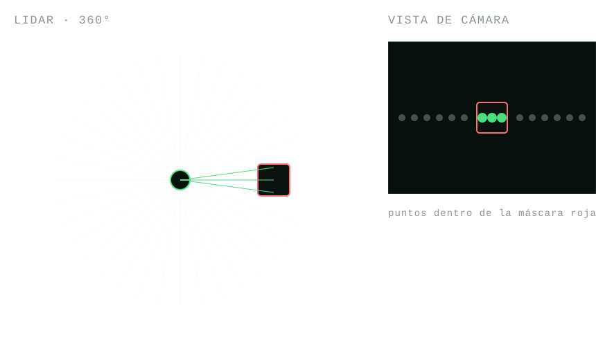

# Semana 04 — Detección de color

## Objetivo

Este workshop tiene dos partes, cada una con su propio nodo. En la
Parte 1, [`detector.py`](deteccion_color/deteccion_color/detector.py)
mira la cámara, reconoce un cuadrado rojo con OpenCV, y avisa en un
tópico (`rojo_detectado`, `std_msgs/Bool`) cada vez que lo ve. En la
Parte 2, [`detector_scan.py`](deteccion_color/deteccion_color/detector_scan.py)
reutiliza esa detección pero proyecta cada punto del lidar (`/scan`)
sobre la imagen de la cámara, para saber **cuáles** de esos puntos caen
sobre algo rojo — con distancia y ángulo reales, el dato que hace falta
para, por ejemplo, navegar hacia él.

Hacé primero la Parte 1 completa (código andando) antes de arrancar la
Parte 2 — la Parte 2 reutiliza código de la Parte 1 y da por sentado que
ya la resolviste. Necesitás la [semana 03](../semana-03-evasion-obstaculos/)
completa: acá se reusa la misma separación entre callback de sensor y
timer de decisión.

---

## Parte 1 — `detector.py`

### Teoría: por qué HSV y no RGB

En una imagen RGB, el rojo no es "un color": es una región difusa de un
espacio de 3 dimensiones que además se mueve mucho con la iluminación —
un rojo bajo sombra tiene valores muy distintos al mismo rojo bajo luz
directa. [HSV](https://docs.opencv.org/4.x/de/d25/imgproc_color_conversions.html)
(Hue/Matiz, Saturation/Saturación, Value/Brillo) separa "qué color es"
(H) de "qué tan intenso" (S) y "qué tan claro" (V). La luz cambia sobre
todo S y V y deja H relativamente estable, así que filtrar por un rango
de H es mucho más robusto a la iluminación que filtrar por RGB.

H se mide en grados alrededor de un círculo ([OpenCV](https://docs.opencv.org/4.x/index.html)
lo comprime a 0-179). El rojo está en 0°, así que un rojo puro aparece
tanto cerca de 0 como cerca de 180 — por eso hacen falta **dos rangos de
H** para capturar todos los rojos, y no alcanza con un solo
[`cv2.inRange`](https://docs.opencv.org/4.x/d2/de8/group__core__array.html#ga48af0ab51e36436c5d04340e036ce981).
Esto no pasa con el azul, que cae cómodo en un solo rango.

Igual que en la semana 03, conviene separar quién guarda datos de quién
decide: el callback de la cámara (`recibir_imagen`) solo convierte la
imagen con [`cv_bridge`](https://github.com/ros-perception/vision_opencv)
y la guarda, no procesa nada. Un timer (`procesar_imagen`), corriendo a
frecuencia fija, es el que agarra la última imagen guardada y decide si
hay un cuadrado rojo. Solo se publica cuando hay un cuadrado — el tópico
es un aviso, no un estado continuo — pero conviene loguear siempre las
transiciones (de "veo" a "no veo" y viceversa), aunque el `False` no se
publique.

### Qué hay que completar

`detector.py` ya trae resuelto lo que no es la detección en sí: los
parámetros ROS, el publisher/subscriber, la conversión de `Image` a
array de OpenCV (`recibir_imagen`), y `area_mayor_contorno` (busca
contornos con [`cv2.findContours`](https://docs.opencv.org/4.x/d4/d73/tutorial_py_contours_begin.html)
y devuelve el área del más grande). Quedan 3 funciones con `TODO`:

1. **`mascara_rojo()`** — la percepción: dada una imagen en HSV,
   devolver una máscara binaria de qué píxeles son rojos, combinando los
   dos rangos de H.
2. **`hay_cuadrado_rojo()`** — usa `mascara_rojo()` y
   `area_mayor_contorno()` para decidir si lo que ve la cámara ahora
   mismo cuenta como un cuadrado rojo.
3. **`procesar_imagen()`** — el timer callback que arma el `Bool`, lo
   publica, y loguea solo cuando el valor cambia.

Completalas en ese orden: `mascara_rojo()` es la pieza chica y fácil de
probar por separado (mirando la máscara con `cv2.imshow` o contando
píxeles) antes de escribir la lógica que la usa.

También hay `TODO` en los archivos de configuración —
**[`setup.py`](deteccion_color/setup.py) `entry_points`** (registrar el
ejecutable `detector`) y **[`package.xml`](deteccion_color/package.xml)
`<depend>`** (declarar las dependencias que usa `detector.py`) — que son
compartidos con la Parte 2: cuando llegues ahí vas a tener que volver a
tocarlos para sumar el ejecutable `detector_scan` y la dependencia
nueva que no usaba la Parte 1, `tf2_ros`.

### Parámetros

Todos son configurables vía `--ros-args -p <nombre>:=<valor>`:

| Parámetro | Default | Qué es |
| --- | --- | --- |
| `hue_rojo_bajo_1` | 0.0 | Límite inferior del primer rango de tono (H, 0-179) para rojo — el rojo "bajo", pegado a 0°. |
| `hue_rojo_alto_1` | 10.0 | Límite superior del primer rango. |
| `hue_rojo_bajo_2` | 170.0 | Límite inferior del segundo rango de tono para rojo — el rojo "alto", pegado a 180°. |
| `hue_rojo_alto_2` | 180.0 | Límite superior del segundo rango. |
| `saturacion_min` | 120.0 | Saturación mínima (0-255). Sin este piso, un gris o un rosa muy pálido también caerían en el rango de H del rojo. |
| `valor_min` | 80.0 | Brillo mínimo (0-255), para descartar zonas muy oscuras. |
| `area_minima_px` | 800.0 | Área mínima (en píxeles) del contorno rojo más grande para contarlo como un cuadrado y no como ruido. |

Si el rojo real queda muy pálido u oscuro bajo la luz del simulador, es
normal tener que calibrar `saturacion_min`/`valor_min` a ojo, mirando la
imagen, en vez de confiar ciegamente en los defaults.

### Cómo correrlo

Con `yahboom_rosmaster` clonado y buildeado en `~/rosmaster_ws` (ver su
[README](https://github.com/AIRclub-UdeSA/yahboom_rosmaster)):

```bash
# Terminal 1 — build
cd ~/rosmaster_ws
colcon build --packages-select deteccion_color
source install/setup.bash
```

Hay varios mundos con cuadrados de colores para detectar (sufijo
`_victimas`). Para ver cuáles hay instalados:

```bash
cd ~/rosmaster_ws
source install/setup.bash
ls "$(ros2 pkg prefix yahboom_rosmaster_gazebo)/share/yahboom_rosmaster_gazebo/worlds/"
```

Podés elegir cualquiera de los `_victimas`; acá usamos
`laberinto_simple_victimas.world` como ejemplo:

```bash
# Terminal 2 — simulador
source install/setup.bash
ros2 launch yahboom_rosmaster_bringup rosmaster_x3_sim.launch.py \
  world:="$(ros2 pkg prefix yahboom_rosmaster_gazebo)/share/yahboom_rosmaster_gazebo/worlds/laberinto_simple_victimas.world" \
  motion_profile:=ideal
```

```bash
# Terminal 3 — nuestro nodo
source install/setup.bash
ros2 run deteccion_color detector
```

El robot arranca sin ningún cuadrado a la vista, así que hace falta
manejarlo con teleoperación por teclado hasta ponerlo frente a uno:

```bash
# Terminal 4 — teleop
source install/setup.bash
ros2 run teleop_twist_keyboard teleop_twist_keyboard
```

Al ser mecanum, además de `i`/`,` (adelante/atrás) y `j`/`l` (girar)
podés usar las teclas en mayúscula (`I`/`J`/`L`/`U`/`O`/`M`/`<`/`>`, con
Shift) para strafear de costado sin girar.

Chequeos útiles en una quinta terminal:

```bash
ros2 topic hz /cam_1/color/image_raw   # confirmar que la cámara publica
ros2 topic echo /rojo_detectado        # solo aparece mientras ve un cuadrado rojo
```

---

## Parte 2 — `detector_scan.py`

### Teoría: de "veo rojo" a "el rojo está ahí"

`detector.py` contesta una pregunta binaria — ¿hay rojo ahora? — pero no
dice **dónde** está el cuadrado respecto del robot. El lidar sí mide
distancia y ángulo con precisión, pero no tiene idea de colores. Esta
parte combina los dos sensores: para cada punto que devuelve el lidar,
preguntarse "si la cámara estuviera mirando justo donde apunta este
rayo, ¿qué píxel le tocaría?", y mirar si ese píxel es rojo.

Para proyectar un punto 3D a un píxel hacen falta dos cosas: dónde está
la cámara respecto del lidar (la transformada entre `laser_link` y el
frame óptico de la cámara, que `robot_state_publisher` ya publica en
[tf2](https://docs.ros.org/en/humble/Tutorials/Intermediate/Tf2/Tf2-Main.html)
a partir del URDF — no hace falta medirla a mano), y el modelo *pinhole*
de la cámara (`u = fx * x/z + cx`, `v = fy * y/z + cy`, con los
intrínsecos publicados en `sensor_msgs/CameraInfo`). Con eso, cada punto
del `/scan` (polar, en el frame del lidar) se pasa a cartesiano, se
rota/traslada al frame de la cámara, y se proyecta a un píxel.



**Ojo:** el lidar escanea en un plano horizontal a altura fija. Si el
cuadrado rojo es una marca chata pegada al piso, la cámara lo ve
perfecto pero el lidar nunca la va a tocar — no hay calibración que
arregle eso.

### Qué hay que completar

Antes de arrancar, copiá tu `mascara_rojo()` ya resuelta de
`detector.py` (acá es una función suelta, porque este nodo corre solo,
sin depender de `detector.py`). El resto de la plomería ya está
resuelta: parámetros, suscripciones a la cámara y al `/scan`, los
callbacks que solo guardan datos, y la búsqueda de la transformada en
tf2. Quedan 3 `TODO`:

1. **El publisher de `/scan_rojo`** — a diferencia de la Parte 1, no
   está creado: hay que declararlo a mano en `__init__` con
   `create_publisher`.
2. **`puntos_laser_a_pixeles()`** — la geometría: dado un array de
   rangos/ángulos del lidar más la transformada y los intrínsecos,
   devolver a qué píxel correspondería cada punto (y si quedó adelante
   o detrás de la cámara), todo vectorizado con numpy.
3. **`recibir_scan()`** — el callback del `/scan` que junta todo: pide
   la transformada, arma los puntos, los proyecta, arma la máscara roja
   de la última imagen, decide qué puntos son rojos, y publica el
   `LaserScan` filtrado.

Los `TODO` de configuración de la Parte 1 (`setup.py` y `package.xml`)
son compartidos con la Parte 2: sumá acá el ejecutable `detector_scan` y
la dependencia nueva que no usaba la Parte 1, `tf2_ros`.

### Parámetros

Los mismos seis parámetros de HSV de la Parte 1 (`hue_rojo_bajo_1`,
`hue_rojo_alto_1`, `hue_rojo_bajo_2`, `hue_rojo_alto_2`,
`saturacion_min`, `valor_min` — ver la tabla en la Parte 1), con el
mismo default y el mismo significado. `detector_scan.py` **no** tiene
`area_minima_px`: esa parte no trabaja con el área de un contorno, sino
con si cada punto del lidar cae o no sobre un píxel rojo.

### Cómo correrlo

No hace falta tener `detector` y `detector_scan` corriendo a la vez, son
procesos independientes — con la Parte 1 ya buildeada (mismo paquete):

```bash
# Terminal 1 — build (si no lo hiciste ya en la Parte 1)
cd ~/rosmaster_ws
colcon build --packages-select deteccion_color
source install/setup.bash
```

```bash
# Terminal 2 — simulador (igual que en la Parte 1)
source install/setup.bash
ros2 launch yahboom_rosmaster_bringup rosmaster_x3_sim.launch.py \
  world:="$(ros2 pkg prefix yahboom_rosmaster_gazebo)/share/yahboom_rosmaster_gazebo/worlds/laberinto_simple_victimas.world" \
  motion_profile:=ideal
```

```bash
# Terminal 3 — nuestro nodo
source install/setup.bash
ros2 run deteccion_color detector_scan
```

```bash
# Terminal 4 — teleop
source install/setup.bash
ros2 run teleop_twist_keyboard teleop_twist_keyboard
```

Al ser mecanum, además de `i`/`,` (adelante/atrás) y `j`/`l` (girar)
podés usar las teclas en mayúscula (`I`/`J`/`L`/`U`/`O`/`M`/`<`/`>`, con
Shift) para strafear de costado sin girar.

Chequeos útiles en una quinta terminal:

```bash
ros2 topic echo /rojo_detectado        # Parte 1 — solo aparece mientras ve un cuadrado rojo
ros2 topic echo /scan_rojo             # Parte 2 — rangos finitos solo en las direcciones "rojas"
```

En [RViz](https://docs.ros.org/en/humble/Tutorials/Intermediate/RViz/RViz-User-Guide/RViz-User-Guide.html),
agregar un segundo display `LaserScan` apuntando a `/scan_rojo` (con
otro color) sobre el `/scan` completo es una buena forma de ver
exactamente qué rayos está clasificando como rojos. Si
`/rojo_detectado` funciona pero `/scan_rojo` nunca marca nada, el
problema está más probablemente en la proyección geométrica o en que el
cuadrado esté fuera del plano que barre el lidar.

---

## Explicación: dos sensores, un mismo objeto

Esta semana es el primer punto donde Donatello combina dos sensores para
entender algo que ninguno de los dos puede solo: la cámara sabe *qué*
color hay, el lidar sabe con precisión *dónde* queda. Esa combinación
—proyectar un sensor sobre otro usando la geometría del robot (tf2) en
vez de asumir posiciones a mano— es la misma técnica que se usa en
robots reales para fusionar cualquier par de sensores montados en
distintos puntos del chasis, y va a reaparecer cada vez que Donatello
necesite ubicar algo en el mundo con más de un sensor.
