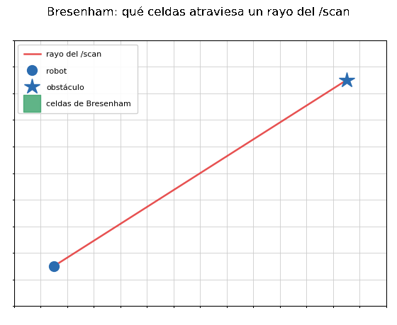
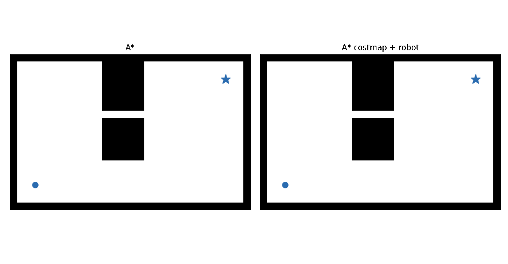
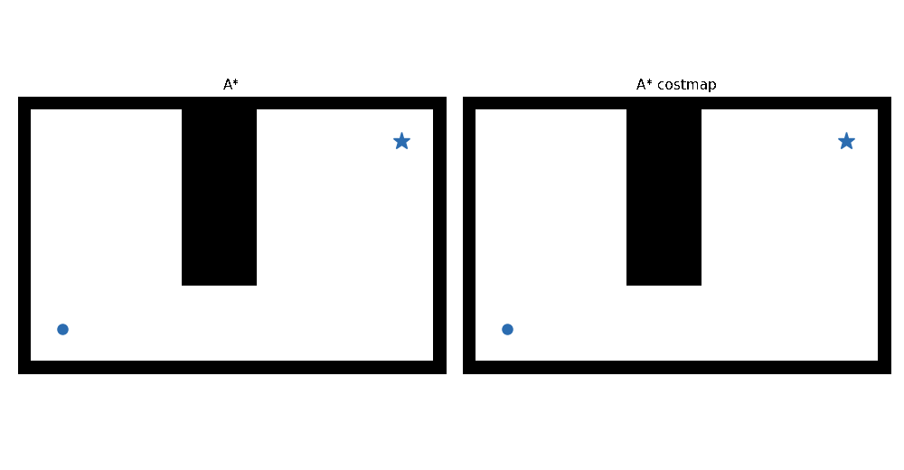
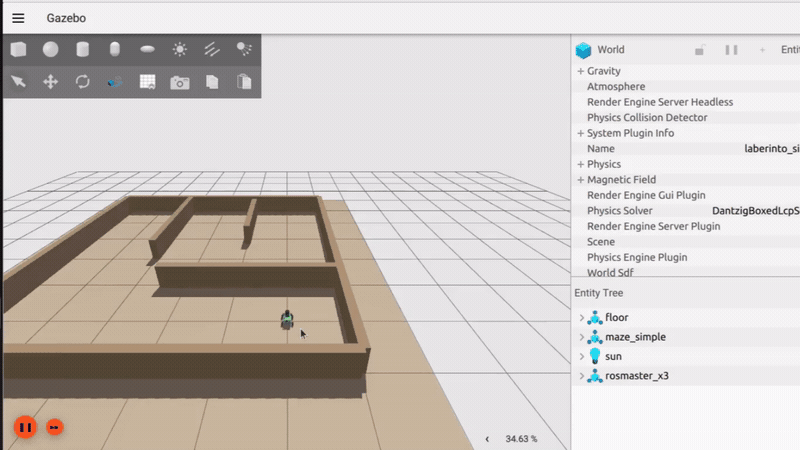

# Semana 08 — Cobertura: explorar el mapa en vez de deambular

## Objetivo

Semana 03 le enseña al robot a no chocar, pero no a buscar de forma
sistemática. En una misión con tiempo limitado, la estrategia de
búsqueda importa tanto como esquivar bien — "avanzar hasta chocar y
girar" no cubre el área de forma confiable, y menos todavía sabe cuándo
terminó. Este workshop hace que el robot recorra **todo** el mapa
conocido por su cuenta, mostrando en vivo qué zonas ya cubrió y cuáles
no — sin que un humano le vaya marcando destinos uno por uno.

Es el último workshop **manual** del roadmap: de acá en más, el que
sigue reemplaza esta lógica hecha a mano por [Nav2](https://docs.nav2.org/)
de fábrica. Por eso este workshop pesa un poco más que los anteriores —
integra localización (semana 06), estructura de paquete propio (semana
06/07) y máquina de estados (semana 03), y agrega dos piezas nuevas:
**planificación de caminos** (A\*) y **cobertura por trazado de rayos**
(Bresenham).

Necesitás la [semana 06](../semana-06-localizacion/) completa (pose en
`map`) y el patrón de paquete propio que ya armaste ahí. No dependés de
la [semana 07](../semana-07-obstaculos-no-mapeados/) — son ramas
hermanas, las dos parten de la 06.

---

## Teoría: cobertura por rayo, no por radio

La forma más simple de llevar la cuenta de "por dónde ya pasé" sería un
círculo de radio fijo alrededor del robot: todo lo que cae adentro,
cubierto. Es tentador porque es una sola cuenta de distancia por celda —
pero **ignora las paredes**. Si el robot pasa a un metro de una víctima
pero hay una pared en el medio, un círculo la marca "cubierta" igual,
aunque el robot nunca haya tenido línea de vista hacia ella. Para una
tarea de búsqueda, eso es un falso positivo grave: el robot "cree" que
ya inspeccionó una zona y no vuelve.

La forma más sofisticada es preguntar, para cada rayo del `/scan`, qué celdas
atravesó realmente ese rayo — respetando paredes por construcción, no
por distancia. Trazar esa línea sobre una grilla es el algoritmo de
[Bresenham](https://en.wikipedia.org/wiki/Bresenham%27s_line_algorithm):
dadas una celda de origen y una de destino, devuelve **todas** las
celdas que la línea recta entre las dos atraviesa, sin huecos ni celdas
salteadas — a diferencia de muestrear la línea a pasos fijos (por
ejemplo con `np.linspace`), donde un paso mal elegido puede saltearse
una celda en un rayo diagonal. Es, literalmente, la misma cuenta que
hace por dentro cualquier algoritmo de mapeo por grilla de ocupación
(SLAM incluido) para actualizar "libre" vs. "ocupado" a partir de cada
rayo de lidar.



### Dos resoluciones, dos propósitos

Este workshop maneja el mapa a dos resoluciones distintas, a propósito:

- Una grilla **gruesa** (`grilla_cobertura`, varias celdas del mapa
  original agrupadas en una), para llevar la cuenta de qué zona ya se
  visitó — agrupar celdas la hace más rápida de cubrir por completo, que
  es lo que importa acá.
- El **mapa original**, a resolución fina, para todo lo que tiene que
  ver con no chocar: la grilla gruesa puede "perder" una pared delgada
  si ocupa menos de la mitad de un bloque agrupado, así que nunca se usa
  para decidir por dónde puede pasar el robot — solo para elegir **qué
  zona** visitar.

### A\* con costmap inflado

Un [A\*](https://en.wikipedia.org/wiki/A*_search_algorithm) que solo
distingue libre/ocupado encuentra el camino más corto —
que casi siempre roza el borde de una pared, porque geométricamente eso
es válido aunque no tenga ningún margen. En la práctica eso es peligroso:
cualquier error chico de localización o de control puede alcanzar para
rozar el obstáculo de verdad. La solución estándar (la misma que usa el
*costmap* de Nav2) es **inflar** el mapa antes de planificar:

- Un **filtro duro**: ninguna celda a menos del radio del robot (más un
  margen de seguridad) de una pared cuenta como transitable. Sin esto,
  A\* podría mandar al robot por un pasillo más angosto que su propio
  chasis, sin tener ninguna forma de saberlo.
- Un **costo suave** por encima de eso: entre las celdas que sí pasan el
  filtro, más caro moverse cerca de una pared, más barato lejos —
  calculado con
  [`scipy.ndimage.distance_transform_edt`](https://docs.scipy.org/doc/scipy/reference/generated/scipy.ndimage.distance_transform_edt.html)
  (la distancia real de cada celda a la pared más cercana) convertida a
  costo con una gaussiana. Con esto, A\* *prefiere* el camino más
  centrado cuando hay margen para elegir, sin prohibir pasar más cerca
  cuando es la única opción.

Por qué importa el filtro duro en particular — tratar al robot como un
cuerpo con radio, no como un punto: en el laberinto de abajo hay un
atajo, una rendija de una sola celda que atraviesa el bloque central.
A\* sin costmap (izquierda) la toma, porque para un punto es un camino
válido y más corto. Al terminar de explorar, un círculo del tamaño real
del robot intenta seguir ese mismo camino y queda **trabado justo en la
rendija** — el plano existe sobre el papel, pero el robot no lo puede
ejecutar. Con el filtro duro (derecha), esa celda queda directamente
afuera del grafo antes de planificar: A\* ni la considera, y rodea por
el único camino que su cuerpo entra.





Elegimos A\* porque es el algoritmo de planificación de caminos más
conocido, pero no es el único que sirve acá — cualquier algoritmo de
búsqueda de caminos que respete el filtro duro y aproveche el costo
suave funciona igual de bien (Dijkstra, D\*, RRT, ...). Si te interesa
comparar variantes,
[PythonRobotics](https://atsushisakai.github.io/PythonRobotics/modules/5_path_planning/path_planning.html)
tiene implementaciones y animaciones de varios algoritmos de
planificación de caminos, además de otras áreas de la robótica —
buen lugar para ver alternativas y cómo se comportan distinto.

### Máquina de estados, otra vez — pero de misión, no de movimiento

La máquina de estados de semana 03 (`AVANZAR`/`GIRAR`) decide, ciclo a
ciclo, cómo moverse. Acá hace falta una máquina de estados de otro
nivel: qué **fase de la misión** está corriendo el robot ahora mismo —
¿está explorando? ¿terminó? Mismas
reglas de diseño que en semana 03 (transición separada de la acción,
loguear cada cambio), aplicadas a un problema distinto — es la forma
estándar de estructurar un sistema que tiene que comportarse distinto
según en qué parte de la tarea está, y vale la pena poder dibujarla
como un diagrama de estados propio, no solo tenerla enterrada en el
código.

### Por qué el robot espera a que un humano le diga dónde está

El robot real no arranca sabiendo su posición en el mapa. La interfaz
de RViz tiene una herramienta pensada justamente para esto,
**"2D Pose Estimate"**, para que un humano marque la posición inicial
aproximada, publicando en el tópico `initialpose`
([`geometry_msgs/PoseWithCovarianceStamped`](https://docs.ros2.org/latest/api/geometry_msgs/msg/PoseWithCovarianceStamped.html)).
Hasta ahora, `localizador.py` de semana 06 arrancaba siempre desde un
`pose_inicial_x/y/theta` fijo por parámetro — cómodo para probar, pero
asume que siempre se sabe de antemano dónde arranca el robot. Esta
semana `localizador.py` aprende a escuchar `initialpose` de verdad, y
el robot se queda quieto hasta que eso pasa. Además, tampoco arranca a
moverse *inmediatamente* después del click: espera unos segundos con el
robot quieto para que el filtro de partículas tenga tiempo de converger
— moverse mientras la pose todavía no asentó compone el error de
localización con el error de movimiento.



---

## Antes de empezar: creá tu paquete

Creá tu paquete, llamado por ejemplo `cobertura_mapa`, y modificá los
archivos correspondientes — mismo procedimiento que en
[semana 06](../semana-06-localizacion/)/[semana 07](../semana-07-obstaculos-no-mapeados/).
Copiá los cuatro archivos de esta carpeta ([`trazado.py`](trazado.py),
[`planificador.py`](planificador.py),
[`grilla_cobertura.py`](grilla_cobertura.py),
[`explorador.py`](explorador.py)) al paquete — te va a hacer falta de
nuevo la misma librería de cálculo científico que ya buscaste en semana
06 para `campo_verosimilitud.py`, ahora para `distance_transform_edt`.
Por último, hacé `colcon build --symlink-install`, otra vez, porque vas
a editar los TODOs muchas veces.

Además, `localizador.py` de tu semana 06 necesita un agregado chico:
una suscripción a `initialpose`
([`geometry_msgs/PoseWithCovarianceStamped`](https://docs.ros2.org/latest/api/geometry_msgs/msg/PoseWithCovarianceStamped.html))
que, al recibir un mensaje, vuelva a sembrar `self.particulas` alrededor
de esa pose (misma cuenta que ya hace tu `__init__` con
`pose_inicial_x/y/theta`, solo que ahora con la `x`/`y`/`theta` que
manda RViz). No es parte de los TODO de esta semana — es un cambio
chico sobre un archivo que ya tenés funcionando, así que te lo damos
resuelto: sumale este método a tu `Localizador` y suscribilo en
`__init__`.

```python
def recibir_pose_inicial(self, msg):
    x = msg.pose.pose.position.x
    y = msg.pose.pose.position.y
    theta = self.yaw_de_quaternion(msg.pose.pose.orientation)
    n = self.num_particulas
    dxy = self.get_parameter('dispersion_inicial_xy').value
    dtheta = self.get_parameter('dispersion_inicial_theta').value
    x0 = np.random.normal(x, dxy, n)
    y0 = np.random.normal(y, dxy, n)
    theta0 = np.random.normal(theta, dtheta, n)
    self.particulas = np.stack([x0, y0, theta0, np.full(n, 1.0 / n)], axis=1)
```

---

## Parte 1 — `grilla_cobertura.py`

### Qué hay que completar

Toda la plomería está resuelta: parámetros, suscripciones (incluida la
de `/scan` en `qos_profile_sensor_data`, como en semanas 03/04/06/07), y
`recibir_mapa()`, que arma la grilla gruesa agrupando bloques del mapa
original (una celda cuenta como transitable si más de la mitad del
bloque que agrupa lo es). Quedan **2 funciones con `TODO`**:

1. **`trazar_rayo()`**, en [`trazado.py`](trazado.py) — Bresenham puro,
   sin ROS. Se puede probar aislado, con un par de celdas de ejemplo,
   antes de tocar nada del nodo (mismo criterio que
   `agrupar_en_rachas()` de semana 07).
2. **`marcar_cobertura()`** — el corazón de este nodo: transformar cada
   rayo del último `/scan` a `map` (reusá acá el patrón de semana
   04/07), y usar `trazar_rayo()` para marcar como cubiertas las
   celdas que atraviesa. `recibir_scan()` ya está resuelta y solo
   guarda el último mensaje (`self.ultimo_scan`) — la lógica corre en
   `marcar_cobertura()`, llamada por un timer a `FRECUENCIA_HZ`, no
   directo desde el callback del sensor (separación sensor/decisión).

Completalas en ese orden.

### Parámetros

| Parámetro | Default | Qué es |
| --- | --- | --- |
| `map_frame` / `base_frame` | `map` / `base_footprint` | Nombres de los frames. |
| `factor_escala` | 4 | Cuántas celdas del mapa original por lado se agrupan en una celda de cobertura. |
| `distancia_minima_valida` | 0.25 | Rango mínimo (m) considerado válido — descarta el rebote del lidar contra la propia estructura del robot, igual que en semana 07. |

### Probarlo solo

Sumá `grilla_cobertura` a tu launch de semana 06 y manejá el robot con
teleop, sin arrancar todavía `explorador`. En RViz, agregá un display
`Map` apuntando a `/grilla_cobertura` con **Color Scheme: costmap**
(mismo ajuste de QoS *transient local* que ya usaste para `/map` y
`/likelihood_map` en semana 06). Vas a ver una zona pasar de rojo
(no cubierta) a verde (cubierta) a medida que el robot recorre el
laberinto — y, si manejás cerca de una pared sin pasar del otro lado,
el otro lado tiene que seguir rojo: esa es la comprobación de que el
trazado respeta las paredes en vez de usar un radio.

---

## Parte 2 — `explorador.py`

### Qué hay que completar

También acá está resuelta toda la plomería: parámetros, suscripciones a
`/map`, `/grilla_cobertura`, `/scan` e `initialpose`, la publicación de
`cmd_vel`/`objetivo_actual`/`camino_planificado`/`estado`, el inflado
del mapa por tamaño del robot (`recibir_mapa()` — ver Teoría), el
seguimiento del camino ya planificado (`siguiente_punto_del_camino()`),
y el vector repulsivo del `/scan` como capa de seguridad secundaria.
Quedan **4 piezas con `TODO`**, de abajo hacia arriba:

1. **`a_estrella()`**, en [`planificador.py`](planificador.py) — A\*
   puro, sin ROS, testeable aislado. Ya viene con la cola de prioridad,
   el registro de mejor costo por celda y la reconstrucción del camino
   resueltos; falta el cuerpo que evalúa cada vecino (bordes de la
   grilla, paredes, no cortar esquina en diagonal, y el costo con la
   `grilla_costo` opcional).
2. **`celda_no_cubierta_mas_cercana()`** — de toda la grilla de
   cobertura, la celda libre no cubierta más cercana al robot. Chica,
   buen calentamiento antes de meterse con la máquina de estados.
3. **`vector_hacia()`** — el vector hacia un punto, expresado en el
   frame del robot. Es donde se aprovecha que Donatello es mecanum: en
   vez de girar el chasis para apuntar y después avanzar (una base
   diferencial), manda `linear.x`/`linear.y` directo, pudiendo
   desplazarse en diagonal sin girar.
4. **`transicionar()`** — los 2 `if` de la máquina de estados de
   misión (ver Teoría): cuándo pasar de `INICIALIZANDO` a
   `EXPLORANDO`, y de `EXPLORANDO` a `TERMINADO`.

Completalas en ese orden: `a_estrella()` primero porque es la pieza más
grande y todo lo demás depende de ella para tener sentido end-to-end.

### Parámetros

| Parámetro | Default | Qué es |
| --- | --- | --- |
| `map_frame` / `base_frame` | `map` / `base_footprint` | Nombres de los frames. |
| `velocidad_maxima` | 0.3 | Tope de velocidad lineal (m/s), en cualquier dirección. |
| `ganancia_atractiva` | 0.6 | Qué tan fuerte tira el siguiente punto del camino. |
| `ganancia_repulsiva` / `radio_repulsion` | 0.15 / 0.4 | Fuerza y alcance (m) de la capa de seguridad secundaria contra el `/scan`. |
| `suavizado` | 0.3 | Peso del comando de velocidad nuevo contra el anterior — evita saltos bruscos al cambiar de waypoint. |
| `tiempo_asentamiento_s` | 3.0 | Cuánto espera quieto, después de confirmada la pose inicial, antes de arrancar a moverse. |
| `radio_robot` | 0.18 | Radio circunscripto del chasis (Donatello mide 0.30 x 0.20 m). |
| `margen_seguridad` | 0.05 | Margen extra sobre `radio_robot` para el filtro duro del inflado. |
| `sigma_costo` | 0.15 | Ancho (m) del costo suave alrededor de cada pared — más chico, más permisivo. |

### Cómo correrlo

Sumá `grilla_cobertura` y `explorador` a tu propio launch de semana 06
(dos `Node` más en la `LaunchDescription`, mismo patrón que ya usaste
para agregar `localizador` y `campo_verosimilitud`). Usá el mundo
`laberinto_simple.world` — el mismo, **sin víctimas**, que ya venías
usando en semana 06: acá no se detecta nada, así que los cubos de
víctimas serían ruido innecesario para la localización (ver Desafío
extra si querés probar igual con ellas puestas).

Agregale a tu config de RViz los displays nuevos:

- `Map` apuntando a `/grilla_cobertura`, **Color Scheme: costmap**
  (igual que en la Parte 1).
- `Marker` (`/objetivo_actual`) y `Path` (`/camino_planificado`), para
  ver la celda elegida como próximo objetivo y el camino que armó A\*.
- La herramienta **"2D Pose Estimate"** en la barra de herramientas de
  RViz — puede que tu config de semanas anteriores no la tenga, porque
  hasta ahora no hacía falta. Si no aparece, agregala con el botón
  **"+"** al lado de "Interact".

Con todo levantado: esperá a que el `Map` y el `LaserScan` se vean
estables (el robot **no** se mueve solo todavía), usá "2D Pose
Estimate" marcando dónde está Donatello, y esperá los
`tiempo_asentamiento_s` — recién ahí arranca a explorar.

---

## Comprobación

Con el robot explorando solo:

- La grilla de cobertura se va pintando de rojo a verde en vivo, y el
  camino (`camino_planificado`, cian) pasa **centrado** por los
  pasillos, no pegado a las paredes.
- El tópico `/estado` transiciona en orden:
  `inicializando → explorando → terminado` — mirá los logs del nodo
  (`Transición: ... -> ...`) para confirmarlo.
- Cuando la grilla queda completamente verde (en las zonas libres), el
  robot se detiene en el lugar — no le queda ninguna celda por cubrir.
- El robot nunca intenta pasar por un hueco más angosto que su propio
  chasis, aunque geométricamente exista un camino más corto por ahí.

---

## Explicación

Con esto, cualquier equipo tiene un robot que decide **solo** qué zona
del mapa visitar y cómo llegar sin chocar, en vez de depender de que un
humano le vaya marcando destinos — el mismo problema que resuelve
`NavigateToPose`/`explore_lite` de Nav2 de fábrica. Vale la pena notar
qué de todo esto es "hecho a mano, en serio" y qué ya es una versión
simplificada de una pieza estándar: el A\* con costmap inflado es,
literalmente, cómo planifica Nav2 por dentro. Cuando llegue el workshop
de Nav2, buena parte de esto se reemplaza por configuración en vez de
código — pero el concepto de fondo es el mismo que acaban de programar
acá.

## Desafío extra

- **Volver a la base**: hoy `explorador` se detiene apenas termina de
  cubrir el mapa. Volver al punto de partida — y, en la competencia
  real, a una meta que puede no ser el punto de partida — queda a
  propósito como ejercicio de cada equipo, no resuelto acá: es
  exactamente el tipo de comportamiento extra que también les va a
  tocar armar en la competencia. Guardá la pose del robot en el momento
  en que confirmás "2D Pose Estimate" (misma cuenta que ya usás para
  fijarla al principio), agregá un estado nuevo (`REGRESANDO_A_BASE`,
  entre `EXPLORANDO` y `TERMINADO`) y reusá el mismo mecanismo de
  planificar con A\* y seguir el camino que ya tenés — el objetivo,
  nada más, pasa a ser esa pose en vez de la celda no cubierta más
  cercana.
- **Calibrar `sigma_costo` en serio**: subilo y bajalo, y mirá cómo
  cambia la forma del camino en pasillos anchos vs. angostos — con
  `sigma_costo` muy alto, ¿el camino se vuelve casi recto en cualquier
  pasillo, o sigue evitando bordes incluso donde hay mucho margen?
- **Reselección de objetivo**: hoy `explorador` recalcula la celda no
  cubierta más cercana en cada tick de control (10 Hz). Probá fijar el
  objetivo hasta llegar a él (o hasta que quede cubierto) en vez de
  recalcularlo todo el tiempo, y compará el comportamiento — ¿cambia
  cuánto tarda en cubrir el mapa completo? ¿Cambia qué tan errático se
  ve el recorrido?
- **Elegir el objetivo por costo de camino, no por distancia recta**:
  `celda_no_cubierta_mas_cercana()` usa distancia en línea recta sobre
  la grilla — una celda "cerca" así puede en realidad requerir un
  rodeo largo si hay una pared en el medio. Correr A\*/Dijkstra una vez
  desde la pose del robot y elegir la candidata más barata por costo de
  camino (no por distancia recta) es más preciso, pero mucho más caro
  de calcular en cada tick — pensá cómo harías para no recalcularlo
  todo el tiempo.
- **Validar en el mundo `_victimas`**: mismo par mundo/mapa que semana
  07 (`laberinto_simple_victimas.world` + `laberinto_simple.yaml`).
  Confirmá que la cobertura y la planificación siguen funcionando con
  obstáculos no mapeados presentes — check de robustez tipo sim2real,
  no hace falta reportar la posición de la víctima (eso sigue siendo
  ejercicio de integración de cada equipo, combinando esto con semana
  04/07).
