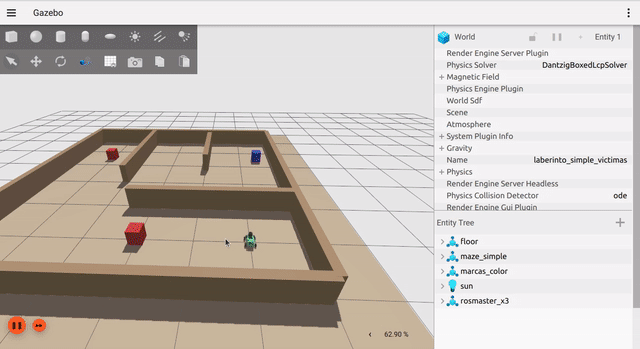
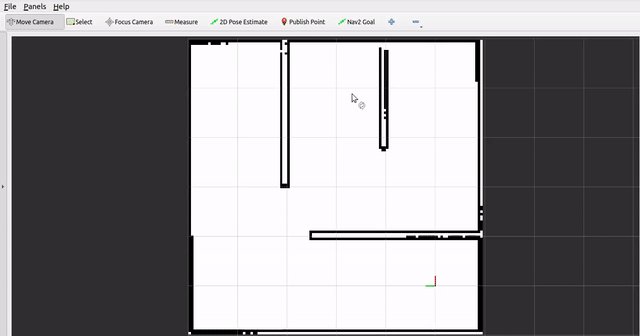
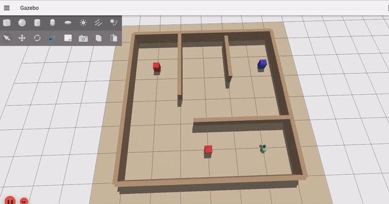
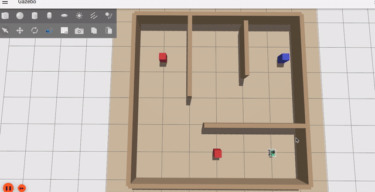
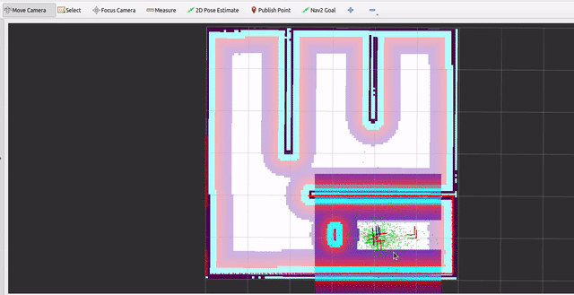

# Semana 09 — Nav2

## Objetivo

Todo lo que armaste hasta ahora —localización (semana 06), evasión de
obstáculos (semana 03), detección de lo no mapeado (semana 07), cobertura
del mapa (semana 08)— era código propio, escrito a mano. [Nav2](https://docs.nav2.org/)
es el stack de navegación estándar de ROS 2: resuelve los mismos problemas,
pero como nodos configurables por parámetros en vez de scripts. Esta semana
no escribís ni configurás nada nuevo — Nav2 ya viene configurado para
reemplazar, uno por uno, cada uno de esos módulos manuales; tu trabajo es
leer esa configuración, correrla, y ver en vivo qué gana (y qué pierde) al
dejar de ser tuyo.

Necesitás la semana [06](../semana-06-localizacion/) completa: el
Checkpoint 1 de hoy reemplaza exactamente el filtro de partículas manual
que armaste ahí, y la comparación solo tiene sentido si tenés fresco cómo
funcionaba tu propia versión.

---

## Antes de empezar: levantar el bringup

A diferencia de semana 06, acá no armás un paquete propio ni tocás código
ni config — [`nav2_params.yaml`](nav2_params.yaml) y
[`launch/nav2_semana09.launch.py`](launch/nav2_semana09.launch.py) ya están
armados; lo que vas a hacer en cada checkpoint es **leer** la configuración
correspondiente y comprobar el resultado en RViz/Gazebo, no editarla. El
launch reusa los launch files estándar de `nav2_bringup` (no hay nodos
propios corriendo Nav2 a mano) y se corre directo por ruta, sin necesidad
de `colcon build`:

```bash
source ~/rosmaster_ws/install/setup.bash
ros2 launch ~/rosmaster_ws/src/jar_workshops/semana-09-nav2/launch/nav2_semana09.launch.py
```

Esperá a que Gazebo y RViz terminen de abrir (Gazebo tarda unos segundos en
cargar el mundo). Vas a ver RViz con la vista default de Nav2: un panel
**"Navigation 2"** a la izquierda con el estado de `Localization` y de
`Navigation` (costmaps, controller, planner, todo el resto del stack que
vas a ir habilitando en los checkpoints de hoy).

---

## Checkpoint 1 — AMCL reemplaza el filtro de partículas manual (sem. 06)

### Teoría: mismo problema, nodo en vez de código propio

En semana 06 escribiste tu propio filtro de partículas: predicción,
corrección contra un campo de verosimilitud, resampleo, todo a mano.
[AMCL](https://docs.nav2.org/configuration/packages/configuring-amcl.html)
(*Adaptive Monte Carlo Localization*) es exactamente ese mismo algoritmo
—las mismas tres etapas, el mismo campo de verosimilitud— empaquetado como
un nodo de Nav2 (`amcl`) que se configura por parámetros en vez de
código. Comparado con semana 06: ahí pedía código propio de resampleo y
pesos; acá es un nodo + un archivo de config.

### Qué hacer

Con el bringup ya levantado (Gazebo + RViz abiertos), clickeá
**"2D Pose Estimate"** en la barra de herramientas de RViz y hacé un click
**aproximado** (no exacto) sobre la pose real del robot en el mapa — el
robot spawnea cerca del origen del mundo, que coincide con el origen del
mapa.

### Qué vas a ver

Una nube de partículas verdes que arranca dispersa alrededor de tu click.
Podés probar cómo se trasladan si movés el robot con teleop
(`ros2 run teleop_twist_keyboard teleop_twist_keyboard`).
El panel "Navigation 2" pasa de `Localization: unknown` a `active`.



### La configuración: leela antes de correrla

A diferencia de semana 06, acá no hay una función con `TODO` para
completar — el nodo `amcl` ya viene de Nav2, no hay código propio que
escribir. Lo que sí tenés que hacer es **leer** [`nav2_params.yaml`](nav2_params.yaml):
cada parámetro de la sección `amcl:` tiene un comentario explicando qué es
y, cuando corresponde, a qué le equivale en tu `localizador.py` de semana
06 (mismo algoritmo, nodo en vez de código). La referencia completa, con
más detalle del que entra en un comentario, es la doc oficial de Nav2:
[Configuring AMCL](https://docs.nav2.org/configuration/packages/configuring-amcl.html).

El parámetro que vale la pena mirar con atención es `robot_model_type`.
nav2_amcl da a elegir entre dos modelos de movimiento —
`nav2_amcl::DifferentialMotionModel` (el default de `nav2_bringup`) y
`nav2_amcl::OmniMotionModel` (el que dejamos puesto acá). Si tenés dudas de por qué elegimos el segundo,
volvé al bloque de teoría de semana 06 ("por qué este modelo y no el del
libro") — es literalmente el mismo argumento.

### Comprobación

Con la pose inicial ya puesta:

- La nube de partículas se contrae alrededor de la pose real del robot en
  vez de quedarse dispersa.
- El panel "Navigation 2" muestra `Localization: active`.
- Probá moverte con teleop en modo holonómico.

---

## Checkpoint 2 — Costmap global + local reemplazan evasión (sem. 03) y detección de no mapeado (sem. 07)

### Teoría: dos mapas de costo en vez de dos módulos manuales

En semana 03 esquivabas obstáculos con una máquina de estados que leía el
lidar y decidía girar o avanzar. En semana 07 comparabas ese mismo lidar
contra el mapa estático para detectar lo que el mapa no tenía. Nav2 resuelve
los dos problemas con la misma pieza, un **costmap**: una grilla que le pone
un costo a cada celda (libre, ocupada, inflada alrededor de un obstáculo) en
vez de que vos calcules distancias a mano. Pero un solo costmap no alcanza —
Nav2 corre **dos**, con roles distintos:

- **`global_costmap`**: cubre todo el mapa conocido (frame `map`, mismo
  tamaño que tu mapa de semana 06), se actualiza una vez por segundo. Su
  capa de abajo es el mapa estático (`static_layer`) — el mismo mapa que le
  diste a `map_server`.
- **`local_costmap`**: una ventana de 3x3 m que viaja centrada en el robot
  (frame `odom`, `rolling_window: true`), se actualiza 5 veces por segundo.
  No tiene mapa estático de fondo — solo lo que el lidar ve *ahora*.

Las dos comparten una `inflation_layer` (el halo alrededor de cada
obstáculo, el margen de seguridad que en semana 03 calculabas a mano) y una
capa que agrega lo que el lidar detecta en vivo. La diferencia clave está en
qué tan agresivo es cada costmap limpiando esa capa: el local descarta y
vuelve a marcar en cada vuelta de scan (por eso "sigue" al robot y un
obstáculo que dejaste atrás desaparece rápido), el global la actualiza más
espaciado y no arranca de cero cada vez. Esa asimetría —local reactivo y de
corto alcance, global estable y de mapa completo— es exactamente la
separación entre "esquivar lo que tengo enfrente" (semana 03) y "saber qué
hay en todo el mapa" (semana 06/07), ahora resuelta por arquitectura en vez
de por dos nodos propios.

### Qué hacer

Con el Checkpoint 1 ya activo (pose inicial puesta, nube de partículas
contraída), mirá el panel **Displays** de RViz: activá (si no están ya) las
capas **"Global Planner"** (el costmap global) y **"Controller"** (el
costmap local) — son nombres poco intuitivos, vienen así por default de
`nav2_bringup` porque cada costmap vive adentro del nodo que lo lleva el
nombre (`planner_server`/`controller_server`), no porque tengan que ver con
plan/control todavía (eso es Checkpoint 3 y 4). Recorré el mapa con teleop,
pasando cerca de las paredes reales y después cerca de alguno de los
cuadrados de color.



### Qué vas a ver

El costmap global pinta un degradé magenta→transparente alrededor de cada
pared **real** del mapa (la inflación) — quieto, no cambia aunque te
alejes. El costmap local es la ventanita de ~3x3 m centrada en el robot: al
acercarte a un cuadrado de color, aparece marcado ahí casi al instante, y
al alejarte se vuelve a limpiar en un par de segundos — herencia directa de
que se recalcula 5 veces por segundo y descarta lo viejo en cada vuelta. El
costmap global, en cambio, tarda mucho más en reflejar ese mismo objeto (si
lo llega a marcar) porque se actualiza 5 veces más espaciado y no limpia
tan agresivo — la comparación en vivo entre los dos paneles de RViz es el
punto central del checkpoint.



### La configuración: leela antes de correrla

Igual que con `amcl:`, las secciones nuevas de [`nav2_params.yaml`](nav2_params.yaml)
— `global_costmap:` y `local_costmap:` — tienen un comentario por
parámetro. El resto de las secciones del
archivo (`controller_server:`, `planner_server:`, `bt_navigator:`, etc.)
tienen que estar configuradas para que este checkpoint funcione — Nav2
levanta esos nodos junto con los costmaps porque cada costmap vive *adentro*
de uno de ellos (`local_costmap` en `controller_server`, `global_costmap`
en `planner_server`) — pero todavía no se explican en detalle: eso es
Checkpoint 3 (controller) y 4 (`NavigateToPose`).

### Comprobación

- El panel "Navigation 2" muestra tanto `Localization: active` como
  `Navigation: active` (antes del Checkpoint 1 este segundo iba a quedar
  colgado en `unknown` — es el mismo gotcha de AMCL: si el costmap global
  no consigue la transformada `map`→`odom`, ninguno de los nodos de
  navegación termina de activarse).
- El costmap global (magenta) sigue las paredes reales del mapa sin
  moverse.
- El costmap local marca un cuadrado de color en vivo apenas te acercás, y
  lo limpia solo al alejarte.

---

## Checkpoint 3 — Controller (DWB) reemplaza la máquina de estados reactiva (sem. 03)

### Teoría: trayectorias candidatas puntuadas en vez de un `if`/`elif`

En semana 03 escribiste una máquina de estados a mano: si el lidar detecta
algo cerca, girar; si no, avanzar. Nav2 resuelve el mismo problema con un
**controller** — acá, [DWB](https://docs.nav2.org/configuration/packages/configuring-dwb-controller.html)
(*Dynamic Window Approach*): en cada ciclo genera un lote de trayectorias
candidatas de corto alcance, le pone un puntaje a cada una según los
costmaps de los Checkpoints 1-2 (evitar lo que marcan) y el plan del
planner global, y ejecuta la de mejor puntaje. Es el mismo problema
—"¿hacia dónde me muevo dado lo que veo?"— resuelto evaluando opciones en
vez de decidir con un `if`.

### Qué hacer

Con los Checkpoints 1-2 ya activos, usá el botón **"Nav2 Goal"** de la
barra de herramientas de RViz y mandá un objetivo **puramente lateral**:
un punto a 90° de hacia dónde mira el robot.

### Qué vas a ver

El robot se desplaza de costado (*strafe*) sin girar primero para encarar
el objetivo — se nota tanto en Gazebo (el chasis se traslada sin rotar)
como en `/cmd_vel` (`linear.y` distinto de cero mientras `linear.x` se
mantiene chico). Confirma que la base es holonómica de verdad y que el
ajuste de DWB (`vy_samples`/`min_vel_y`/`max_vel_y` del yaml) se ejerce de
verdad, no que solo está declarado.

**Un gotcha para anticipar:** el robot llega a la posición del goal pero
**nunca termina mirando hacia la orientación final** que marcaste con el
Nav2 Goal — se queda con el heading que traía del último tramo de la
trayectoria. No es un bug: sacamos a propósito el crítico `RotateToGoal`
de la config de DWB (ver más abajo).



### La configuración: leela antes de correrla

La sección `controller_server:` de [`nav2_params.yaml`](nav2_params.yaml)
—en particular `FollowPath:`, el plugin DWB— ya tiene comentario por
parámetro, igual que `amcl:` y los costmaps. Los dos que vale la pena
mirar con atención:

- `min_vel_y`/`max_vel_y`: en 0.0 por default en `nav2_bringup` (asume un
  robot diferencial que no puede moverse de costado); acá habilitados
  porque el X3 es mecanum.
- `critics`: no incluye `RotateToGoal` (sí está en el default de
  `nav2_bringup`) — es la causa directa del gotcha de arriba. En su lugar
  sumamos `Twirling`, para que el robot no gire sobre su propio eje sin
  necesidad al tener grados de libertad de sobra.

### Comprobación

- Mandar un Nav2 Goal lateral (a 90° del robot).
- El robot se desplaza de costado, sin girar antes de arrancar.
- `ros2 topic echo /cmd_vel` muestra `linear.y` distinto de cero durante el
  movimiento.
- Al llegar, la posición coincide con el goal pero la orientación final
  del robot no necesariamente — es el comportamiento esperado (ver
  Desafíos extra).

---

## Checkpoint 4 — `NavigateToPose` reemplaza la exploración por waypoints (sem. 08)

### Teoría: una sola acción que integra los tres checkpoints anteriores

En semana 08 armaste tu propia lógica de cobertura: una lista de waypoints
y un criterio propio de "cuál sigue". Nav2 empaqueta ese mismo problema
—llegar a un punto lejano, replanificando en el camino— en una sola acción,
[`NavigateToPose`](https://docs.nav2.org/behavior_trees/overview/nav_to_pose_with_replanning_and_recovery.html):
`bt_navigator` le pide un camino a `planner_server` (el planificador
global, mismo problema que tu A* de semana 08), se lo va pasando en tramos
al `controller_server` del Checkpoint 3 (que esquiva en vivo con los
costmaps del Checkpoint 2, localizado por el `amcl` del Checkpoint 1), y
si algo falla reintenta o replanifica solo. Es el mismo recorrido de
semana 08, pero pedido de una vez en lugar de armado punto por punto.

### Qué hacer

Con los Checkpoints 1-3 ya activos, mandá un **Nav2 Goal arbitrario a un
punto lejano** del mapa — cruzando al menos un par de pasillos y esquinas,
no un lateral corto como en el Checkpoint 3.

### Qué vas a ver

El robot llega solo, sin que vos escribas ninguna lógica de "siguiente
punto": planifica un camino sobre el costmap global, lo sigue con el
controller, y si en el medio le cruzás un obstáculo con teleop, replanifica
en vivo en vez de quedarse trabado. El mismo gotcha de orientación final
del Checkpoint 3 aplica acá también — llega a la posición pero no
necesariamente mirando hacia donde apuntaba el Nav2 Goal.



### La configuración: leela antes de correrla

La sección `planner_server:` de [`nav2_params.yaml`](nav2_params.yaml) ya
tiene comentario por parámetro, igual que el resto. El parámetro que vale
la pena mirar con atención es `use_astar`: en `false`, así que el
`GridBased` de acá corre Dijkstra en vez de A* — el mismo problema de
semana 08 (camino más corto sobre una grilla de costos) pero sin la
heurística que guía la búsqueda hacia el objetivo. Si tenés curiosidad,
ponelo en `true` y compará qué tan distinto planifica contra tu propia
implementación de A*.

`bt_navigator:` también tiene comentario en sus parámetros propios (no en
la lista larga de `plugin_lib_names`, que es boilerplate de registro de
nodos que Nav2 trae de fábrica) — ahí se explica cómo encadena
planner_server y controller_server.

### Comprobación

- Mandaste un Nav2 Goal lejano, cruzando pasillos.
- El robot llegó solo, sin intervención tuya, planificando y siguiendo el
  camino.
- Si le cruzaste un obstáculo en el medio con teleop, replanificó en vez
  de quedarse trabado.

---

## Desafíos extra

> Estos desafíos son para cuando termines los cuatro checkpoints — no son
> parte de la comprobación de ningún checkpoint puntual.

- **Hacer que el robot sí termine mirando hacia la orientación final del
  goal.** El Checkpoint 3 documentó por qué no lo hace (sacamos
  `RotateToGoal` de los `critics` de DWB a propósito, para no arruinar la
  demostración de strafe puro). Investigá cómo lograr las dos cosas a la
  vez.
- Combiná este workshop con nodos de semanas anteriores para ir más
  allá — no todo tiene que ser nuevo, tenés cuatro semanas de código
  propio corriendo sobre un mapa y un mundo que no cambiaron.
- [`explore_lite`](https://github.com/robo-friends/m-explore-ros2) para
  explorar el mapa sin un objetivo fijo, en vez de mandar un `NavigateToPose`
  a un punto (Checkpoint 4).
